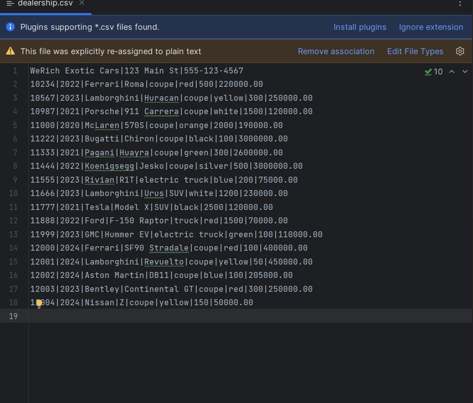
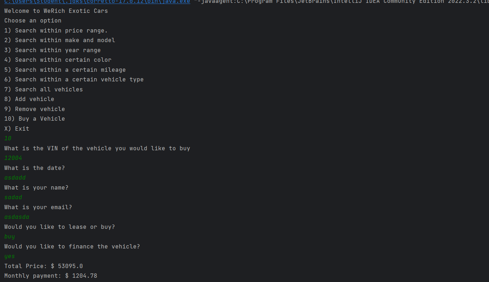
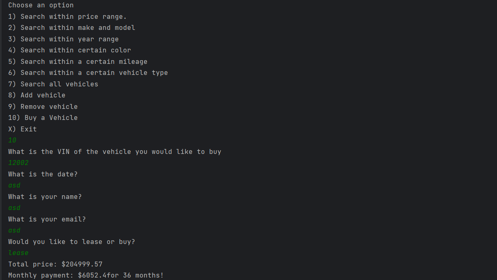
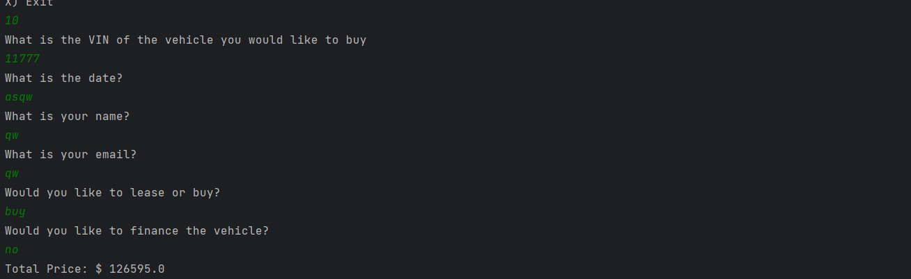
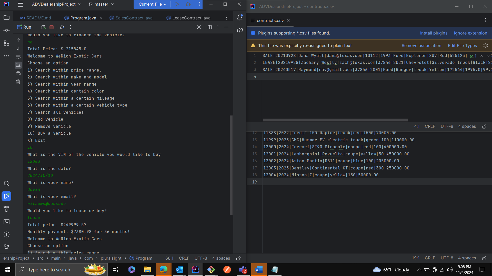
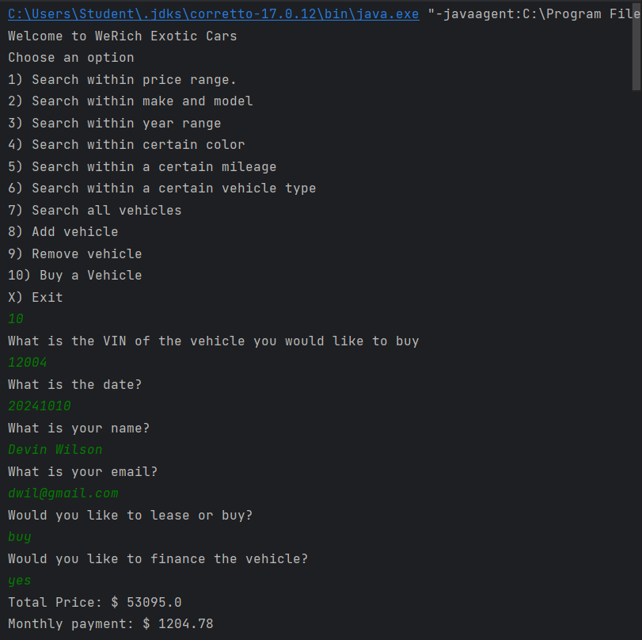
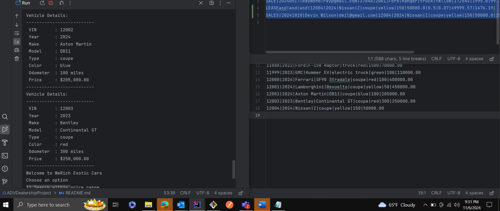
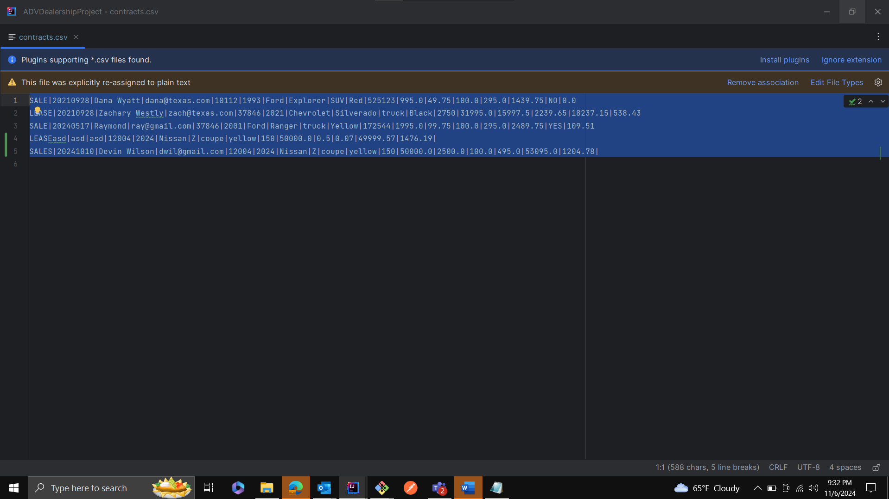

# Dealership Application

## Description of the Project

This version of my application allows for me to generate contracts for buyers of my vehicles. These contracts will be saved into a contract inventory. Also, the final price on the vehicle will be dependent on financing or leasing and the cost of the car.

## User Stories

-As a user I would like to have the ability to offer buyers contracts on vehicles.
-As the buyer I would like to be able to buy a car.
-As the buyer I would like to be able to lease a car.
-As a user I would like to keep an inventory of all the contracts that have been made.
-As a user I would like to be able to buy a vehicle on the main menu of the application.

## Setup

The application while ask for an input with corresponding action. Once given an input it will display a filtered version of the inventory, will prompt to add or remove vehicle. In addition it will ask users if they would like to buy and vehicle and route they would like to do so. Rather that be financing one or leasing.

### Prerequisites

- IntelliJ IDEA: Ensure you have IntelliJ IDEA installed, which you can download from [here](https://www.jetbrains.com/idea/download/).
- Java SDK: Make sure Java SDK is installed and configured in IntelliJ.

### Running the Application in IntelliJ

Follow these steps to get your application running within IntelliJ IDEA:

1. Open IntelliJ IDEA.
2. Select "Open" and navigate to the directory where you cloned or downloaded the project.
3. After the project opens, wait for IntelliJ to index the files and set up the project.
4. Find the main class with the `public static void main(String[] args)` method.
5. Right-click on the file and select 'Run 'YourMainClassName.main()'' to start the application.

## Technologies Used

- IntelliJ IDEA Community Edition 2022.3.2

## Demo

Include screenshots or GIFs that show your application in action. Use tools like [Giphy Capture](https://giphy.com/apps/giphycapture) to record a GIF of your application.

List of vehicles 

Finance vehicle 
Lease vehicle 
Buying car no finance 
Before 
After purchase 

## Future Work

- want to be able to add new dealerships and add their csv files.
- Would like to prompt users to select what dealership inventory they would like to look at.

## Resources

List resources such as tutorials, articles, or documentation that helped you during the project.

- https://github.com/users/Devinswil/projects/4/views/1?pane=issue&itemId=84838191
- https://github.com/RayMaroun

## Team Members

-Brandon

## Thanks

- Thank you to Raymond for continuous support and guidance.
- Brandon for helping with questions and concerns and also taking turns taking an ear beating my Raymond for code mistakes. LOL
